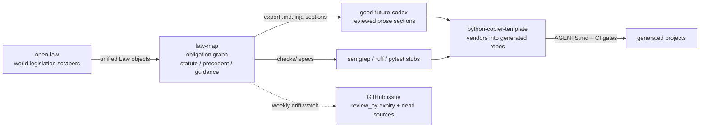

# law-map

Machine-readable **obligation graph** of a legal-compliance ecosystem: law,
organized as technical obligations mapped to jurisdiction groundings.

Instead of a flat "regulations" table, law-map stores *deontic rules you can
implement* (prohibitions, obligations, permissions) with the legal sources
that ground them — statutes, regulations, precedent, and guidance alike.
The unifying idea is **functional equivalence**: when a Japanese statute, an
EU regulation and a US FTC enforcement action all require the same technical
behavior, they are one obligation node with multiple groundings.

## Ecosystem



- [open-law](https://github.com/ConstitutiveTemplates/open-law) — scrapes
  world legislation into unified Law objects (exists; untouched here).
- **law-map (this repo)** — organizes law as technical obligations, mapped
  to jurisdiction groundings covering civil law (statutes) and common law
  (precedent/guidance) via functional equivalence.
- [good-future-codex](https://github.com/ConstitutiveTemplates/good-future-codex) —
  reviewed human/AI-facing prose sections consumed by templates.
- [python-copier-template](https://github.com/ConstitutiveTemplates/python-copier-template) —
  vendors everything into generated AGENTS.md/CI.

## Layout

```
schemas/obligation.schema.yml   field reference (types, constraints, enums)
obligations/<domain>/<slug>.yml one obligation per file (reviewed by humans)
checks/<domain>/<slug>.yml      machine-check specs, optional per obligation
src/law_map/                    loader, validator, checker, exporter, CLI
tests/                          pytest suite (offline)
docs/why-law-map.md             design note: functional equivalence
.github/workflows/              ci.yml, drift-watch.yml (weekly review scan)
```

## Quickstart

```bash
uv sync
uv run law-map validate            # load corpus, report every error/warning
uv run law-map validate --codex codex/   # also cross-check related_sections against a good-future-codex checkout
uv run law-map list                # all obligation ids
uv run law-map show privacy/no-cleartext-pii-logging
uv run law-map check               # groundings due for review (default 30 days)
uv run law-map check --sources --days 30   # also HEAD-check source URLs
uv run law-map export --out out/   # codex-style .md.jinja section skeletons
uv run pytest -q
uv run ruff check .
uv run mypy src/law_map
```

Or with [just](https://github.com/casey/just): `just check` runs validate +
pytest + ruff + mypy.

## Validation contract

`law-map validate` exits non-zero if the corpus violates any rule in
`schemas/obligation.schema.yml` (implemented in `src/law_map/model.py`):
required fields, enums, id pattern (`obligation.<domain>.<slug>`) and
uniqueness, grounding shape (jurisdiction, source_type, status, authority,
citation, ISO `review_by`, non-empty http(s) `sources`), and cross-references
(`requires`/`conflicts` ids, `enforcement.check_refs` files). Files whose
basename starts with `_` are excluded from the corpus (see
`obligations/_example.yml`). Without `--codex`, unknown `related_sections` only
warn; with `--codex <checkout>` they are validated against that
good-future-codex checkout's `sections/MANIFEST.yml` ids plus each
`sections/**/*.md.jinja` frontmatter `id`, and an id not present becomes an
error.

## Review freshness

Every grounding carries a `review_by` date — the freshness contract. The
weekly `drift-watch` workflow runs `law-map check --sources --days 30` and
opens one GitHub issue (`law-drift` label) listing groundings due or expired
plus source URLs that now 404 or redirect; when a run is clean it closes any
open `law-drift` issue with a "drift resolved" comment. `law-map check` exits
1 when any grounding is expired, so the workflow can gate on it.

## License

Apache-2.0. See [LICENSE](LICENSE).

**Not legal advice.** law-map records what instruments say and where they are
pinned; it does not interpret them for a specific situation. See
`docs/why-law-map.md`.